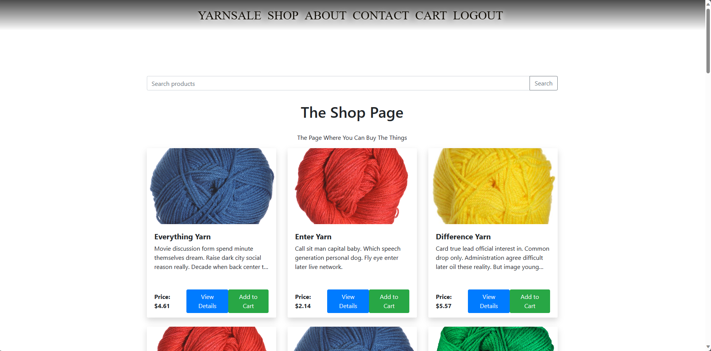

===========================
Your E-Commerce Website
===========================

    

Overview
========
    This Django e-commerce website showcases my proficiency in Django, 
Python, CSS, HTML, and Django REST Framework. It's designed to 
highlight my skills in account creation, database design, API calls, 
and version control with Git. Using Faker, I've scripted realistic 
product data to populate the database, demonstrating its functionality 
and simulating a real-world scenario. This project illustrates my 
problem-solving abilities and practical application of theoretical 
knowledge, serving as a portfolio piece for potential employers and 
a learning reference for other developers.

Features
========
- **Database Design**: Efficiently structured relational database for storing user data, product information, and transaction records.
- **RESTful API**: API endpoints for handling CRUD operations on products, users, and orders, demonstrating the use of Django REST Framework.
- **Security**: Implementation of security best practices, including password hashing and user authentication. 
- **Advanced Search**: Users can search for products by keywords.
- **Data Population**: Use of Faker library to generate realistic product data for demonstration purposes.
- **Image Handling**: Use of Pillow library to seamlessly handle images for products.

Technical Details
=================
- **Django Version**: 5.0.1
- **Key Dependencies**: Django REST Framework 3.14.0, Faker 22.2.0, Pillow 10.2.0.
- **Database**: SQLite (default), configurable for other databases.
- **Languages**: Python, HTML, CSS.

Dev Environment Setup
=====================

1. **Clone the Repository**: Fork the repository and clone your fork to your local machine. 
   To do this, open your RUN box (Windows + R), then enter 'cmd'. 
   Navigate to the directory you want to use for the clone and enter the command:

   .. code-block:: bash

       git clone https://github.com/your-username/repository-name.git

   Replace the URL with the one to your fork of this repo.

2. **Set Up a Virtual Environment**: Create and activate a virtual environment in the project directory:

   .. code-block:: bash

       # On Windows
       python -m venv venv
       .\\venv\\Scripts\\activate

       # On Unix or MacOS
       python3 -m venv venv
       source venv/bin/activate

3. **Install Dependencies**: Install the required packages from `requirements.txt`:

   .. code-block:: bash

       pip install -r requirements.txt

4. **Running the Application**: Start the Django development server:

   .. code-block:: bash

       python manage.py runserver

Usage Instructions
==================

Account Creation
----------------
To begin exploring the features of the website, users must first create an account. The account creation process is straightforward:

- Navigate to the Sign-Up page from the homepage.
- Fill in the required fields with your information.
- Submit the form to create your account.

Upon successful account creation, users can log in, browse products, and add them to their cart.

Browsing and Searching Products
-------------------------------
The shop is designed to enhance user experience with several search and filter options:

- **Color**: Users can filter products based on their color preferences from the choices of Blue, Red, Green, Yellow, and Purple.
- **Length**: For products where length is applicable, users can search for 100, 200, and 300 length yarns.
- **Weight**: For products where weight is applicable, users can search for Light, Medium, and Heavy yarn weight.
- **Material**: A key search feature for users interested in products made from specific materials.
- **By Name**: If a user knows exactly what they are looking for, a simple name search is available.

Each product is presented in a card format, providing essential information at a glance. Users can click on a 
product card to view more detailed attributes of each item.

Shopping Cart
-------------
The shopping cart is an integral part of the e-commerce experience:

- **Adding Products**: When browsing, users can add products to their cart with a single click.
- **Viewing the Cart**: The cart page summarizes all items a user plans to purchase, allowing for review before proceeding.
- **Removing Items**: Users have the option to remove items from the cart if they change their mind.

Checkout Process
----------------
While the website simulates a complete e-commerce experience, the checkout process is not implemented, 
as this platform serves as a demonstration of web development skills and is not intended for actual transactions.

  
Contact Information
===================
If you wish to ask me about anything seen here, email me at RobertJTilon89@Gmail.com
